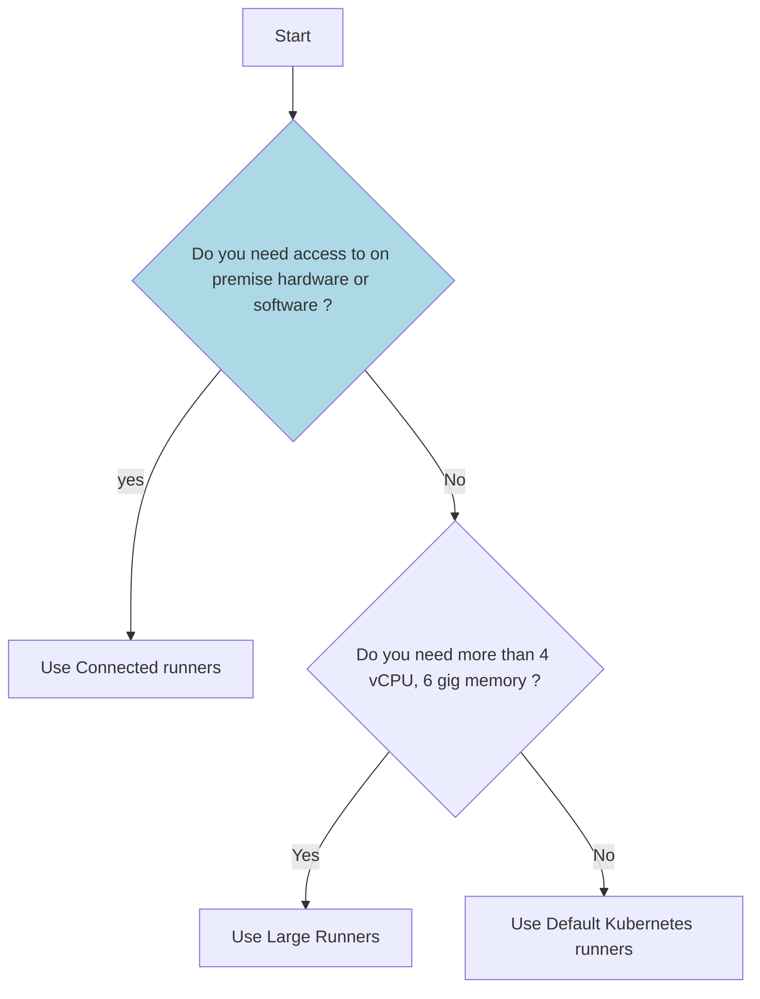

# GitHub EMU Runners

> [!NOTE]  
> Hyperlinks are only for reference and may not work.

> [!Warning]
>
> This document refers to GitHub EMU, which is not yet generally available. For information about GitHub Runers on GitHub Enterprise please refer to this document.

## TLDR

- We provide self-hosted runners for GitHub EMU, this is recommended way to run your GitHub Actions
- For some use cases you can use [GitHub hosted runners](#github-hosted-runners)
- We also configure a special type of runners called ["The Company" Connected Runners](#"The Company"-connected-runners), which can connect to on-premise hardware and devices in "The Company" network

## How to decide which runners to use?

> [!NOTE]  
> Due to rendering issue the Mermaid diagram is not rendering on the site.



## "The Product" Self-hosted Runners
### Kubernetes Runners

These are ephemeral runners which use fresh kubernetes pod for every GitHub action run.
They are suitable for jobs which require less than or equal to `4 vCPU` and `6 GiB memory`. These runners use [sysbox](https://github.com/nestybox/sysbox) as container runtime to improve container isolation, enabling them to run workloads similar to a VM (for e.g. they can run docker containers).

**Example**

```yaml
---
name: kubernetes-runners

on:
  workflow_dispatch:

jobs:
  kubernetes-runners:
    runs-on: [self-hosted, sg-kubernetes, ap-northeast-1]
    steps:
      - uses: actions/checkout@v3
      - run: |
          echo "Hello World!"
```

### Large Runners

These are ephemeral runners which use fresh EC2 instances for every GitHub action run.
The warm pool is not maintained for these runners, and upon receiving event for the action run, it takes **90 to 120** seconds for these runners to bootup and execute the workload. For efficiency, these runners use the spot capacity.

If you observe that it is taking more than 20 - 30 mins to launch the instance, we recommend you to [cancel](https://docs.github.com/en/actions/managing-workflow-runs/canceling-a-workflow) and [re-run](https://docs.github.com/en/actions/managing-workflow-runs/re-running-workflows-and-jobs) the workflow atleast once, as it can happen due to any of the following:
- GitHub doesn't retry the failed payload events, which means there is a probability of event being dropped or missed.
- AWS doesn't have SLA on the boot time of EC2 instance, which means there is a probability of EC2 instance being stuck in boot phase.
- Spot capacity or spot quota may have been momentarily exhausted.

If the issue still persists, please get in <a href="#2">touch with us</a>.

**Example**


```yaml
---
name: large-runner

on:
  workflow_dispatch:

jobs:
  connected-runner:
    runs-on: [self-hosted, sg-large, ap-northeast-1]
    steps:
      - uses: actions/checkout@v3
      - run: |
          echo "Hello World!"

# X large runner
---
name: x-large-runner

on:
  workflow_dispatch:

jobs:
  connected-runner:
    runs-on: [self-hosted, sg-xlarge, ap-northeast-1]
    steps:
      - uses: actions/checkout@v3
      - run: |
          echo "Hello World!"

# 3X large runner
---
name: 3x-large-runner

on:
  workflow_dispatch:

jobs:
  connected-runner:
    runs-on: [self-hosted, sg-3xlarge, ap-northeast-1]
    steps:
      - uses: actions/checkout@v3
      - run: |
          echo "Hello World!"

# 4X large runner
---
name: 4x-large-runner

on:
  workflow_dispatch:

jobs:
  connected-runner:
    runs-on: [self-hosted, sg-4xlarge, ap-northeast-1]
    steps:
      - uses: actions/checkout@v3
      - run: |
          echo "Hello World!"

```

## GPU Runners

These are ephemeral runners which use fresh EC2 instances for every GitHub action run.
The warm pool is not maintained for these runners, and upon receiving event for the action run, it takes **180 to 300** seconds for these runners to bootup and execute the workload. For efficiency, these runners use the spot capacity. AMI is based on Deep Learning AMI GPU PyTorch 1.13.1 (Ubuntu 20.04). More details in [Aha idea](https://"The Product".ideas.aha.io/ideas/SG-I-105)

If you observe that it is taking more than 20 - 30 mins to launch the instance, we recommend you to [cancel](https://docs.github.com/en/actions/managing-workflow-runs/canceling-a-workflow) and [re-run](https://docs.github.com/en/actions/managing-workflow-runs/re-running-workflows-and-jobs) the workflow atleast once, as it can happen due to any of the following:
- GitHub doesn't retry the failed payload events, which means there is a probability of event being dropped or missed.
- AWS doesn't have SLA on the boot time of EC2 instance, which means there is a probability of EC2 instance being stuck in boot phase.
- Spot capacity or spot quota may have been momentarily exhausted.

If the issue still persists, please get in <a href="#2">touch with us</a>.


```yaml
# GPU runner
---
name: gpu-runner

on:
  workflow_dispatch:

jobs:
  connected-runner:
    runs-on: [self-hosted, sg-gpu, ap-northeast-1]
    steps:
      - uses: actions/checkout@v3
      - run: |
          echo "Hello World!"
```

!!! Note

    These runners should only be used for jobs which require powerful hardware.

    You will require to raise request to access these runners. Please refer to the [below table](#runner-specification).

    These runners utilitzes EC2 Spot, if you face issues, please get in get in [touch with us](#how-to-get-in-touch-with-team-if-i-face-issues-or-problems).

!!! Warning

    Please don't use these runners until it has been assigned to your repositories. In an event, if it occurs, depending on the scenario we might request you to re-run/re-trigger/cancel your in-progress or scheduled GitHub action run jobs.

### Elastic Machines

Elastic machines is Github runner solution developed and maintained by Github team. "The Product" offers elastic machines control plane to allow our customers to create runners in their own AWS VPC (virtual private cloud) so that they can connect to the required infrastructure.

"The Product" team only manages the elastic machines control plane, the actual runners should be deployed in each team's AWS account. Elastic machines control plane assumes the IAM role created in the respective team's AWS account to create the Github runners in their VPC. Elastic machines support following providers in AWS

AWS EC2: The AWS EC2 instance provider allows you to scale runners on EC2 instances without deploying any additional infrastructure (e.g. Auto Scaling groups)
AWS Autoscaling Group: This provider can be used to scale EC2 instances in an Auto Scaling group. All instances will use the Auto Scaling group's launch template so will have a uniform configuration. This provider is deperecated.

Detailed documentation is available at EMU [sg-innersource elastic-machine-docs repository](https://github.tmc-"The Product".com/wit-"The Product"/elastic-machines-docs)

!!! Note

    AWS Autoscaling groups provider has been deprecated and will be removed in a future version of Elastic Machines. Existing provider configurations should be migrated to use the AWS EC2 provider, which requires less setup and is feature-equivalent


## Runner specification

<table>
  <thead>
  <tr class="header">
    <th>Runner</th>
    <th>vCPU</th>
    <th>Memory(GiB)</th>
    <th>Disk Size(GiB)</th>
    <th>Label</th>
    <th>Operating system</th>
    <th>Architecture</th>
    <th>Use case</th>
    <th>How to get access?</th>
    <th>Egress IPs</th>
    <th>SLO</th>
  </tr>
  </thead>
  <tbody>
    <tr>
      <td>Kubernetes Runner</td>
      <td>4</td>
      <td>6</td>
      <td>500 shared across 4 runners</td>
      <td>[self-hosted, sg-kubernetes]</td>
      <td>Ubuntu 20.04</td>
      <td>amd64</td>
      <td>General purpose</td>
      <td>Please request access via <a href="https://portal.tmc-"The Product".com/docs/default/Component/"The Product"-WELCOME-GUIDES/contact-us/">contact us page</a></td>
      <td>35.74.160.34, 18.176.246.18, 54.238.56.89</td>
      <td>N/A</td>
    </tr>
    <tr>
      <td>Connected Runner</td>
      <td>8</td>
      <td>16</td>
      <td>75</td>
      <td>[self-hosted, wp-connected]</td>
      <td>Ubuntu 20.04</td>
      <td>amd64</td>
      <td>Job which requires access to the on-prem hardware and devices (for e.g. license server, Test rigs)</td>
      <td>Please request access via <a href="https://portal.tmc-"The Product".com/docs/default/Component/"The Product"-WELCOME-GUIDES/contact-us/">contact us page</a></td>
      <td>18.181.0.207</td>
      <td>N/A</td>
    </tr>
    <tr>
      <td>Large Runner</td>
      <td>8</td>
      <td>16</td>
      <td>75</td>
      <td>[self-hosted, sg-large]</td>
      <td>Ubuntu 20.04</td>
      <td>amd64</td>
      <td>Job which requires high CPU and Memory (for e.g. OS compilation)</td>
      <td>Please request access via <a href="https://portal.tmc-"The Product".com/docs/default/Component/"The Product"-WELCOME-GUIDES/contact-us/">contact us page</a></td>
      <td>56.64.123.10, 35.77.155.135, 35.78.149.202</td>
      <td>N/A</td>
    </tr>
    <tr>
      <td>x-Large Runner</td>
      <td>16</td>
      <td>32</td>
      <td>100</td>
      <td>[self-hosted, ubuntu-2004, sg-xlarge]</td>
      <td>Ubuntu 20.04</td>
      <td>amd64</td>
      <td>Job which requires high CPU and Memory (for e.g. OS compilation)</td>
      <td>Please request access via <a href="https://portal.tmc-"The Product".com/docs/default/Component/"The Product"-WELCOME-GUIDES/contact-us/">contact us page</a></td>
      <td>56.64.123.10, 35.77.155.135, 35.78.149.202</td>
      <td>N/A</td>
    </tr>
    <tr>
      <td>3x-Large Runner</td>
      <td>48</td>
      <td>96</td>
      <td>500</td>
      <td>[self-hosted, ubuntu-2004, sg-3xlarge]</td>
      <td>Ubuntu 20.04</td>
      <td>amd64</td>
      <td>Job which requires high CPU and Memory (for e.g. OS compilation)</td>
      <td>Please request access via <a href="https://portal.tmc-"The Product".com/docs/default/Component/"The Product"-WELCOME-GUIDES/contact-us/">contact us page</a></td>
      <td>56.64.123.10, 35.77.155.135, 35.78.149.202</td>
      <td>N/A</td>
    </tr>
    <tr>
      <td>4x-Large Runner</td>
      <td>64</td>
      <td>128</td>
      <td>500</td>
      <td>[self-hosted, ubuntu-2004, sg-4xlarge]</td>
      <td>Ubuntu 20.04</td>
      <td>amd64</td>
      <td>Job which requires high CPU and Memory (for e.g. OS compilation)</td>
      <td>Please request access via <a href="https://portal.tmc-"The Product".com/docs/default/Component/"The Product"-WELCOME-GUIDES/contact-us/">contact us page</a></td>
      <td>56.64.123.10, 35.77.155.135, 35.78.149.202</td>
      <td>N/A</td>
    </tr>
    <tr>
      <td>GPU Runner with Ubuntu 20.04 (g4dn.xlarge) </td>
      <td>4</td>
      <td>16</td>
      <td>100</td>
      <td>[self-hosted, ubuntu-2004, sg-gpu]</td>
      <td>Ubuntu 20.04</td>
      <td>amd64</td>
      <td>Job which requires high CPU and Memory (for e.g. OS compilation)</td>
      <td>Please request your github organization administrator to enable runners via <a href="https://github.tmc-"The Product".com/github-apps/enterprise-multi-runners">Enterprise multi runners</a> github application for the required repository</td>
      <td>56.64.123.10, 35.77.155.135, 35.78.149.202</td>
      <td>99%</td>
    </tr>
  </tbody>
</table>

!!! Note

    Egress IPs mentioned in the above table may change, when that happens we will be updating this documentation.

### Known Issues

<details>
    <summary> Ownership issue during docker build or docker pull</summary>
</br>
<p>Tarball archive can contain files with preserved uid/guid which can be outside of the supported range from sysbox </p>

<p>For example `Cannot change ownership to uid 1099713, gid 1049089: Invalid argument` </p>

<p>Please add the following argument `--no-same-owner` to the tar command when extracting in the Dockerfile.s</p>

```bash
  tar -zvxf data.tar.gz -C /data --no-same-owner
```

</details>

### FAQ

<details>
    <summary> Do kubernetes runners support Docker in Docker?</summary>
</br>
<p>Yes, kubernetes runners supports Docker in Docker. It uses a different runtime which allows you to run Docker in Docker without any need of privilege escalation. </p>

<p>When using docker in docker for kubernetes runners, container must run docker engine with the root user. Optionally you can add non-root user to sudoers list and docker group to communicate with the docker daemon. </p>

<p>When using docker in docker for kubernetes runners, please remove user options</p>

```yaml
  container:
    image: docker.artifactory-ha.tri-ad.tech/docker:20.10-git
    options: -u 1001:998
## Above should be changed to the following
  container:
    image: docker.artifactory-ha.tri-ad.tech/docker:20.10-git
```

</details>

<details>
    <summary> How to install Nix with kubernetes runners?</summary>
    </br>

Nix should be installed with `sandbox = false` configuration with Kubernetes runners.

</details>

<details>
    <summary>How to check the installed OS packages on these runners?</summary>
    </br>
The list of installed OS packages is available at `/wit/meta-data/packages.txt`.
</details>

<details>
    <summary>Which runners should be used to build multi-platform container images?</summary>
    </br>

Large runners should be used to build multi-platform container images.

</details>

<details>
    <summary>Which runners should be used to run Podman?</summary>
    </br>

Large runners should be used for Podman.

</details>

<details>
    <summary>Which runners should be used to run CodeQL?</summary>
    </br>

Large runners should be used for CodeQL.

</details>

<details>
    <summary>How to get in touch with team if I face issues or problems?</summary>
    </br>

Please get in touch via <a href="../../../contact-us/">contact us</a> page.

</details>

<details>
    <summary>How GitHub organization administrator can associate default kubernetes runners with repositories?</summary>
    </br>
    <p>
    <ul>
        <li>Go to Settings menu of the Organization.</li>
        <li>Go to Actions -> Runner Groups.</li>
        <li>Select the `sg-kubernetes` from `Shared by Enterprise` section.</li>
        <li>Under `Repository access` section, select `All Repositories`. If required, check the `Allow public repositories` to associate these runners with the public repositories in the organization.</li>
      </ul>
      </pl>
      </details>

## GitHub Hosted Runners

### About GitHub-hosted runners

- The [GitHub hosted runners](https://docs.github.com/en/enterprise-cloud@latest/actions/using-github-hosted-runners/about-github-hosted-runners) are available to you by default, they have the [following specs and labels](https://docs.github.com/en/enterprise-cloud@latest/actions/using-github-hosted-runners/about-github-hosted-runners#supported-runners-and-hardware-resources)
- We currently have 50,000 minutes of GitHub hosted runners per month for all GitHub users. We haven't established any organization-level limits for the GitHub hosted runners
- We recommend you to use GitHub hosted runners only for [MacOs and Windows](https://docs.github.com/en/enterprise-cloud@latest/actions/using-github-hosted-runners/about-github-hosted-runners#supported-runners-and-hardware-resources) workflows, and use [self-hosted runners](#"The Product"-self-hosted-runners) for all you Linux workflows. The [self-hosted runners](#"The Product"-self-hosted-runners) are cheaper than the GitHub hosted runners and don't consume our monthly minutes
- Before you start using GitHub hosted runners, please read [GitHub hosted runners pricing](https://docs.github.com/en/enterprise-cloud@latest/billing/managing-billing-for-github-actions/about-billing-for-github-actions) and [GitHub hosted runners limits](https://docs.github.com/en/enterprise-cloud@latest/actions/reference/usage-limits-billing-and-administration#usage-limits)
- We don't have plans to provide [Large GitHub Hosted Runners](https://docs.github.com/en/enterprise-cloud@latest/actions/using-github-hosted-runners/using-larger-runners)

```
runs-on: [macos-latest]
```

or

```
runs-on: [windows-latest]
```

### FAQ

**What happen if we use all our monthly minutes for GitHub hosted runners?**

- All GitHub hosted runners will be unavailable until the next month


## "The Company" Connected Runners

These are ephemeral runners which use fresh EC2 instance for every GitHub action run. These runners use Generation 1 network so that they can connect to on-premise hardware and devices.
The warm pool is not maintained for these runners, and upon execution of the action run, it takes **90 to 120** seconds for these runners to bootup and execute the workload.

!!! Note

    These runners should only be used for jobs which require access to on-premise devices or hardware.

    You will require to raise request to access these runners. Please refer to the [below table](#runner-specification).

    These runners utilitzes EC2 Spot, if you face issues, please get in [touch with us](#how-to-get-in-touch-with-team-if-i-face-issues-or-problems).

!!! Warning

    Please don't use these runners until it has been assigned to your repositories. In an event, if it occurs, depending on the scenario we might request you to re-run/re-trigger/cancel your in-progress or scheduled GitHub action run jobs.

!!! Warning

    Connected runners are only available to "The Company" engineering teams as these runners have access to "The Company" network and devices.

**Example**

```yaml
---
name: connected-runner

on:
  workflow_dispatch:

jobs:
  connected-runner:
    runs-on: [self-hosted, wp-connected, ap-northeast-1]
    steps:
      - uses: actions/checkout@v3
      - run: |
          echo "Hello World!"
```

## Release Notes

| Version | Date         | Description   | Author(s)| Approver(s) |
| --- | --- | --- |  --- | ---  |
| 1.2     | 5 Sep, 2023 | Added documentation for elastic machines | Person 1 |  Person 2<br> Person 3 |Person 2<br> Person 3 |
| 1.0     | 15 Dec, 2022 | Final version | Person 1 |  Person 2<br> Person 3  |
